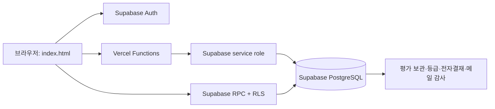
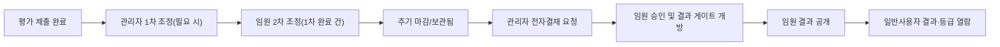

# 아키텍처

## 책임 경계

- 브라우저: 표시, 입력, Supabase 로그인 세션, 비민감 UI 설정
- Supabase RPC: 배정된 대상/문항 조회와 평가 제출. 제출 시 서버에서 배정, 기간, 관계, 문항 가중치, 필수 응답을 재검증
- Vercel API: 사용자 관리, 배정 관리, 조정·전자결재, 등급 계산/보관, 관리자 메일 발송
- Supabase service role: Vercel Functions 내부에서만 사용. 브라우저에는 노출 금지

## 결과 공개 흐름

점수와 세부 코칭은 공개 전 일반 사용자에게 반환하지 않습니다. 등급 메일도 승인·게이트·공개 조건을 모두 만족한 보관 결과만 사용합니다.

## 문항과 관계

`matchings.relationship_type`은 `internal`, `exchange`, `leadership` 중 하나입니다. `my_assigned_questions`와 `submit_evaluation_central`은 동일한 관계·직군 규칙을 사용하여, 브라우저 요청 조작으로 다른 문항을 제출할 수 없게 합니다.

## 배포 경계

현재 작업은 로컬에만 존재합니다. migration과 환경변수 설정, 역할별 E2E 검증이 끝난 뒤에만 별도 배포 절차로 진행합니다.
